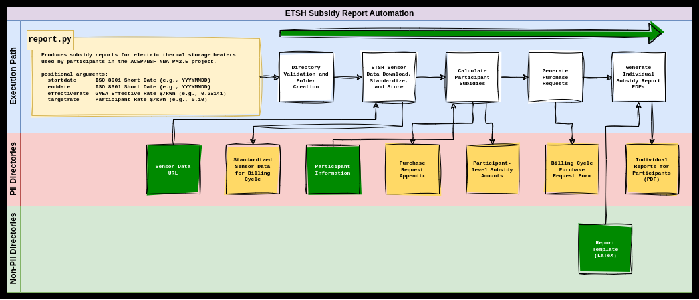
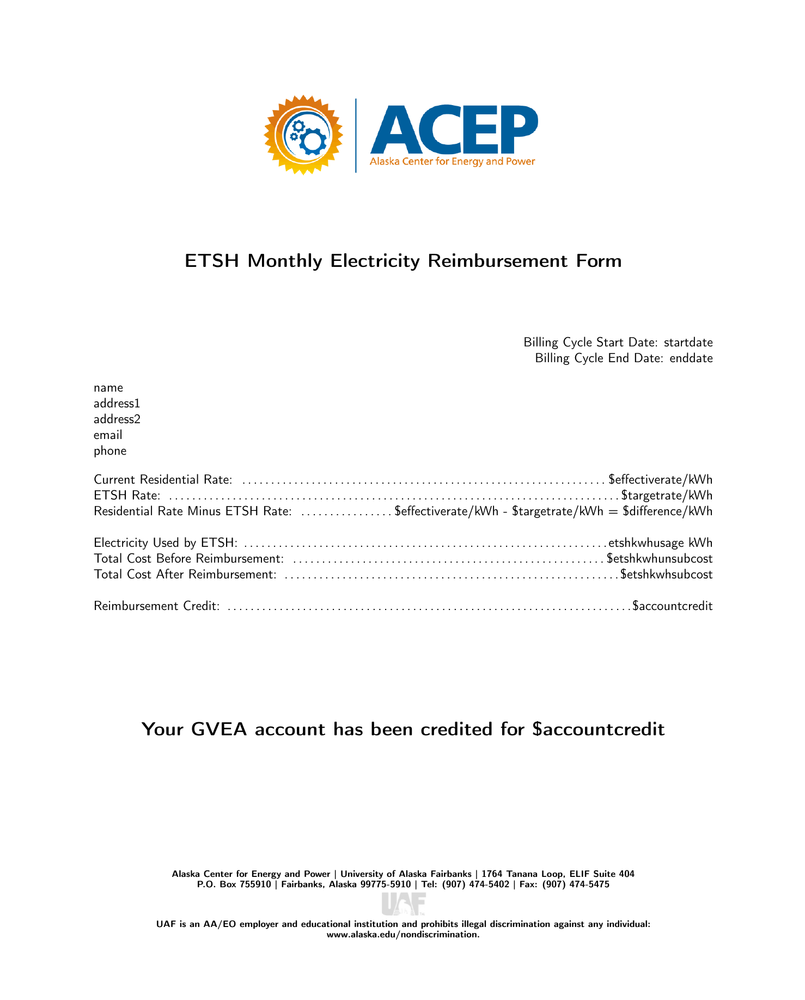

<!---
Image generated with Microsoft Image Generator with the following terms: automation sleeping programmer
-->

# ETSH Subsidy Report Automation
This repository stores automation code for generating the monthly FNSB Electric Thermal Storage Heater (ETSH) participant subsidy reports. The following personally identifiable information (PII) is not included, but required:
```
nna-fnsb-etsh-subsidy-reports/
└── pii/
    ├── participant-info.csv
    └── sensor-url.txt
```
With those two files, the script follows the following execution path to generate billing cycle subsidy calculations, purchase request form autofilling and appendix creation, and run a LaTeX subprocess to generate individualized reports for sending to participants. I strongly recommend building a virtual envrionment based on the package requriments in `requirements.txt` (e.g., `$ (venv) pip install -r requirements.txt`). Must have a local LaTeX distribution to call `pdflatex filename.tex`.


# Usage
```
$ (venv) python report.py -h

Produces subsidy reports for electric thermal storage heaters used by participants in the ACEP/NSF NNA PM2.5 project.

positional arguments:
  startdate      ISO 8601 Short Date (e.g., YYYYMMDD)
  enddate        ISO 8601 Short Date (e.g., YYYYMMDD)
  effectiverate  GVEA Effective Rate $/kWh (e.g., 0.25141)
  targetrate     Participant Rate $/kWh (e.g., 0.10)

options:
  -h, --help     show this help message and exit

GNU Affero General Public License v3.0
```

Example report:



